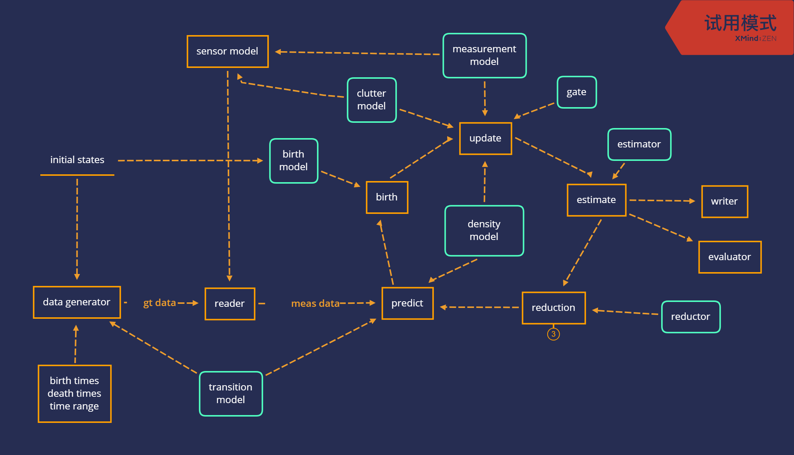

# StateCircle
状态循环：多传感器多目标融合库，实现了多种单/多目标滤波/跟踪融合算法

## 术语
- 状态(`State`)：在`statecircle`中状态是一个泛化的描述，指代库中的不同分布表示

- 搜索区域(surveillance area)：人为指定的算法工作区域，为2维平面或3维空间

- 滤波(filtering)：依据历史时刻至当前时刻的所有观测对当前搜索区域内目标状态量进行更新，不输出轨迹

- 跟踪(track)：依据历史时刻至当前时刻的所有观测对当前搜索区域内目标状态量进行更新，输出轨迹，每段轨迹有唯一标识

## 主要模块

### 状态类(`Types`)

#### 密度/强度(density/intensity)状态
- 高斯状态(`GaussianState`)：包含充分统计量`mean`与`cov`属性，描述一个高斯分布。
- 高斯和状态(`GaussianSumState`)：描述一个为高斯和形式的强度函数，包含一组权重以及对应的高斯状态属性
- 高斯混合状态(`GaussianMixtureState`)：描述一个为高斯混合形式的密度函数，包含一组权重(权重之和为1)以及对应的高斯状态属性
- 无迹状态(`UnscentedState`)：描述无迹变换下的高斯分布表示，在无迹共轭密度模型`UnscentedKalmanDensity`中被使用
- 粒子状态(`ParticleState`)：描述任意分布的粒子表示，在粒子共轭密度`ParticleDensity`中被使用

#### 随机有限集(Random finite sets)状态
- 伯努利状态(`BernoulliState`)：包含存在概率`prob`以及一个密度/强度状态`state`，表示伯努利随机有限集
- 伯努利轨迹(`BernoulliTrajectory`)：继承自伯努利状态，并附加出生时刻(`t_birth`)，死亡时刻(`t_death`)以及死亡权重(`w_death`)三个属性，用来表示单目标轨迹
- (TODO)多伯努利状态(`MultiBernoulli`)：表示多伯努利随机有限集
- (TODO)多伯努利混合状态(`MultiBernoulliMixture`)：表示多伯努利混合随机有限集，有两种等价表示
  - 全局假设表示
      - Multi-Bernoulli states
  - 局部假设表示
      - Hypothesis look-up table
      - Hypothesis forest 
- Poisson状态(`PoissonState`)：包含一个强度函数属性，表示泊松随机有限集(泊松点过程)

#### 其他状态
- 标签状态(`LabeledState`)：任意状态可继承标签状态来扩展唯一ID以形成轨迹

### 模型类(`Models`)

#### 共轭密度模型(`ConjugatedDensityModel`)
共轭密度模型用保证每个滤波/跟踪器中的状态在整个状态循环过程中维持相同的假设密度函数(assumed density function)，每个共轭密度模型提供三个接口方法：
- predict：预测状态
- update：更新状态
- predicted_log_likelihood：预测观测似然

具体实现包括：
- 卡尔曼密度模型(`KalmanDensityModel`)：用于线性高斯模型假设，卡尔曼滤波组件
- 扩展卡尔曼密度模型(`KalmanDensityModel`)：用于非线性程度不高的模型假设，扩展卡尔曼滤波组件
- 卡尔曼累计密度模型(`KalmanAccumulatedDensityModel`)：对累计密度函数进行估计，平滑输出轨迹
- 无迹卡尔曼密度模型(`UnscenetedKalmanDensityModel`)：用于非线性模型假设，无迹卡尔曼滤波组件
- 粒子密度模型(`ParticleDensityModel`)：用于任意非线性模型假设，粒子滤波组件

#### (*)出生模型(`BirthModel`)
描述物体出现，分为：
- 单目标出生模型
- 多目标出生模型

#### (*)观测模型(`MeasurementModel`)
描述传感器观测过程
- 线性观测模型：
- 非线性观测模型：RangeBearing
-（TODO）点物体检测，框物体检测，扩展物体观测，强度观测
-杂波模型：
  - 泊松杂波模型
  - (TODO)状态依赖伯努利杂波模型

#### (*)转移模型(`TransitionModel`)
描述状态转移过程
- 线性转移模型：CV
- 非线性转移模型：CTRV
- (TODO)

#### 跟踪器(`Tracker`)
跟踪器(`Trackers`)目录下实现了多种单/多目标滤波/跟踪算法，所有算法实现在滤波基类(`Filter`)中的`filtering`方法中被统一为相同的流程：
1. predict
2. birth
3. update
4. estimate
5. reduction

每种算法实现在滤波主循环中的各个步骤维持各自相同形式的状态，完成状态的循环。

图中状态循环包含5个个状态，`predict`, `birth`, `update`, `estimate`与`reduction`，在循环开始时，由`reader`读取
观测数据送入`predict`模块，此时`predict`只是记录当前观测数据的时间戳`timestamp`后即返回，并未做实际的状态预测
运算，然后陆续经过后续模块后再回到`predict`时，此时`Tracker`类已经记录了初始帧的时间戳，在`predict`模块拿到当前
观测时即可计算出两次观测数据时间间隔，然后才可进行`predict`运算。

具体实现可分为单目标跟踪与多目标跟踪两大类

##### 单目标跟踪器
- 最近邻跟踪器(`NearestNeighbourTracker`)
- 概率数据关联跟踪器(`ProbabilisticDataAssociationTracker`)
- 高斯核跟踪器(`GaussianSumTracker`)
- 伯努利跟踪器(`BernoulliTracker`)

##### 多目标滤波/跟踪器
- 全局最近邻跟踪器(`GlobalNearestNeighbourTracker`)
- 联合概率数据关联跟踪器(`JointProbabilisticDataAssociationTracker`)
- 多假设跟踪器(`MultiHypothesisTracker`)
- 概率假设密度滤波器(`PHDFilter`)
- (TODO)概率假设密度跟踪器(`PHDTracker`)
- (TODO)集势概率假设密度滤波器(`CPHDFilter`)
- 多伯努利混合滤波器(`MBMFilter`)
- 多伯努利混合跟踪器(`MBMTracker`)
- 泊松多伯努利混合滤波器(`PMBMFilter`)
- 泊松多伯努利混合跟踪器(`PMBMTracker`)
